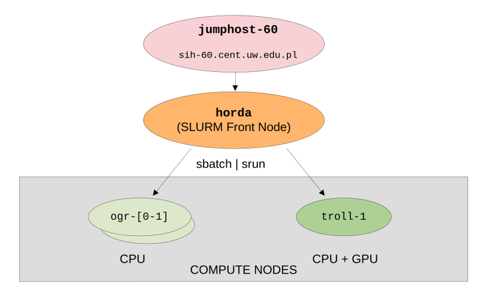

### **Setting up an account**
In order to create your an account on the HORDA cluster please contact Maciek or Pawel via e-mail.

** After the account is approved you will receive credentials via e-mail from the <code> it @ cent.uw.edu.pl </code> address.**


The obtained password will allow you to login to the entry node (jumphost-60) at <code>sih-60.cent.uw.edu.pl</code> and from there 
to login to the HORDA cluster front-node (ssh horda) and use the compute [nodes](resources.md) <code>ogr-[0-1] and troll-[1]</code>.

** Please familiarize yourself with the general rules of cluster usage before proceeding
further - [LINK](rules.md) **

!!! Warning
    **Important:** in case of lost password or other technical difficulties related to the **entry node** 
    (not cluster front node or compute nodes) please reach out to the IT department at CeNT UW - address: <code>it @ cent.uw.edu.pl</code>.
    
    Include the <code>[sih-60]</code> prefix in the message title and add cluster administrators @Maciek and @Pawel in CC.

!!! Information
    **Please note that password changes on each of the compute nodes and the entry node are synced. It is advised to change your initially obtained password after first login.**

### **Connecting via SSH**
Connections to the HORDA cluster are handled via SSH protocol. See the figure below
for a brief introduction of the network organization:


In order to login to the entry node you can issue the following command:

```sh
ssh your_username@sih-60.cent.uw.edu.pl
```
This will bring you to the **entry node (jumphost-60)**, afterwards you can connect to the horda front node and submit tasks to the **compute nodes** 
([click here](resources.md) for a complete list of available resources), for example:
```sh
ssh your_username@horda
```

**In order to simplify file copying and every day work the suggested way of connecting
to the <code>horda</code>cluster is to use [sshuttle](https://github.com/sshuttle/sshuttle). This allows to
bypass the login node and work almost the same way as being connected via VPN to the local network.**

!!! Example
    Assuming <code>sshuttle</code> was installed according to the [guide](https://sshuttle.readthedocs.io/en/stable/installation.html)
    you can connect as follows:
    ```sh
    sshuttle --dns -NHr your_username@sih-60.cent.uw.edu.pl 10.10.60.1/24
    ```
    Once connection is established you can directly login to the horda front node or compute nodes using:
    ```sh
    ssh your_username@horda.sih-60.internal
    ```
    
!!! Information
    Additionally, depending on your computer and network settings, you may have to connect to <code>horda</code> nodes 
    once without <code>sshuttle</code> so that SSH connections are properly configured.

To avoid putting password during each login you can set up authorization via a certificate - additional information
is available [here](https://www.digitalocean.com/community/tutorials/how-to-configure-ssh-key-based-authentication-on-a-linux-server)

### **Work environment**
Each user has access to two personal directories:

- <code>/home/users/your_username</code>
- <code>/workspace/your_username</code>
!!! Warning
    **These folders are shared between all nodes of the HORDA cluster but not with the jumphost-60. Please don't use the jumphost to store large volumes of data.** 

[//]: # (    &#40;please follow the [guidelines]&#40;faq.md#what-are-the-guidelines-for-homenfs-distributed-filesystem-use&#41;&#41;.)

### **Transferring files**
The recommended options to send or fetch files from HORDA cluster are either <code>scp</code> or <code>rsync</code>.

The storage on the entry host <code>sih-60.cent.uw.edu.pl</code> is **very** limited therefore it is recommended to setup
**sshuttle** to send / fetch files directly to the shared space on the horda cluster.

!!! Information
    Assuming you established a connection with <code>sshuttle</code> you can directly send files or
    directories to the cluster:
    ```sh
    scp file.txt your_username@horda.sih-60.internal:~/
    ```

### **Next steps**
Once the basics are set up you should be able to start running calculations. Follow the next chapter for more details.
